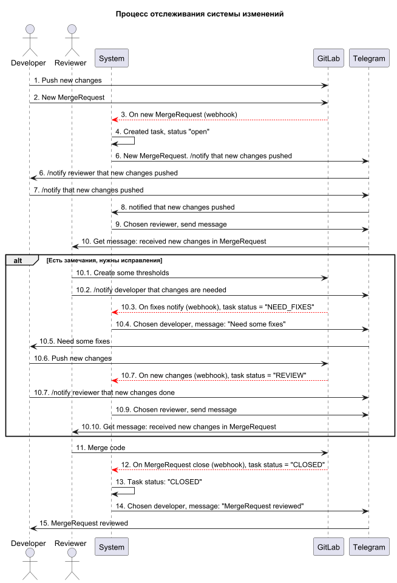

## 1. Процесс работы

1. Разработчик - пушит код на ГИТЛАБ.
2. Разработчик - создает мр на ГИТЛАБ.
3. Система - видит что создался мр.
4. Система - присылает создателю в ТЕЛЕГРАМ уведомление о создании мр, кнопку для отправки уведомления в СИСТЕМУ.
3. Разработчик - нажимает кнопку "уведомить и новом мр".
4. Гитлаб - отправляет данные о новом мр в СИСТЕМУ.
5. Система - получает уведомление о новом мр от ГИТЛАБ и создает у себя задачу со статусом "открыт".
6. Система - выбирает РЕВЬЮЕРА и отправляет сообщение в ТЕЛЕГРАМ.
7. Ревьюер - получает сообщение от ТЕЛЕГРАМ.
   - если есть замечания - отписывает замечание в мр в ГИТЛАБ.
   - Ревьюер - нажимает кнопку "уведомить о замечаниях".
   - Система - получает уведомление от ГИТЛАБ о необходимых доработках в мр.
   - Система - отправляет уведомление в ТЕЛЕГРАМ о необходимых доработках в мр.
   - Разработчик - получает уведомление от ТЕЛЕГРАМ о необходимых доработках в мр.
   - Разработчик - исправляет замечания и пушит код на ГИТЛАБ.
   - Система - увидела обновленный мр от РАЗРАБОТЧИКА.
   - Система - отправила в ТЕЛЕГРАМ уведомление об обновленном мр.
   - Ревьюер - получил от ТЕЛЕГРАМ уведомление об обновленном мр.
8. Ревьюер - идет проверять мр на ГИТЛАБ.
9. Ревьюер - если замечаний нет - нажимает кнопку merge на ГИТЛАБ.
10. Гитлаб - отправляет в СИСТЕМУ данные что мр закрыт.
11. Система - получила от ГИТЛАБ данные что мр закрыт.
12. Система - меняет статус у задачи на "закрыт".
13. Система - отправила уведомление в ТЕЛЕГРАМ разработчику.
14. Разработчик - получает от ТЕЛЕГРАМ уведомление что мр проверен.

## 1.1 Типы пользователей

- **Разработчик** – пишет код, отправляет его на проверку, исправляет ошибки.
- **Проверяющий (ревьюер)** – проверяет код, оставляет комментарии, одобряет или отклоняет изменения, 
    сливает код в основую ветку.

## 1.2 Статусы проверки
- 🟡 "На проверке" – присваивается при создании MR.
- 🔴 "Исправить" – присваивается, если есть замечания.
- ✅ "Закрыто" – присваивается после успешного мержа. Проверяющий оставляет комментарий "Done".
- 🔵 "Открыто (OPEN)" – задача создана, но работа над ней еще не началась.
- 🟠 "В процессе (IN_PROGRESS)" – работа над задачей идет.
- 🟣 "Нужна информация (NEED_INFORMATION)" – требуется дополнительная информация для выполнения.
- 🛠 "Требуются исправления (NEED_FIXES)" – задача требует доработки после проверки.
- 👀 "На ревью (REVIEW)" – задача отправлена на проверку.

## 2. Диаграмма последовательности
[код диаграммы](process.puml)

